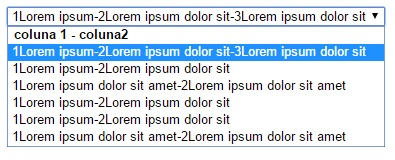

# select-grid
Simulando colunas dentro de uma tag &lt;select>(html).

# Utilizando

 ## Pré-requisitos
>&lt;script src='https://cdnjs.cloudflare.com/ajax/libs/jquery/3.1.1/jquery.min.js'&gt;&lt;/script&gt;


## Instalando
> &lt;script src="select-grid.js"&gt;&lt;/script&gt;

```html
<select class="select-grid">
    <optgroup label="coluna 1 - coluna2"></optgroup>
    <option value="0">1Lorem ipsum-2Lorem ipsum dolor sit-3Lorem ipsum dolor sit</option>
    <option value="1">1Lorem ipsum-2Lorem ipsum dolor sit</option>
    <option value="2">1Lorem ipsum dolor sit amet-2Lorem ipsum dolor sit amet</option>
    <option value="3">1Lorem ipsum-2Lorem ipsum dolor sit</option>
    <option value="4">1Lorem ipsum-2Lorem ipsum dolor sit</option>
    <option value="5">1Lorem ipsum dolor sit amet-2Lorem ipsum dolor sit amet</option>
</select>
```

```javascript
$('.select-grid').SelectGrid({
    size: 10,
    multiple: false
});
```
# Resultado

## De 

## Para 
